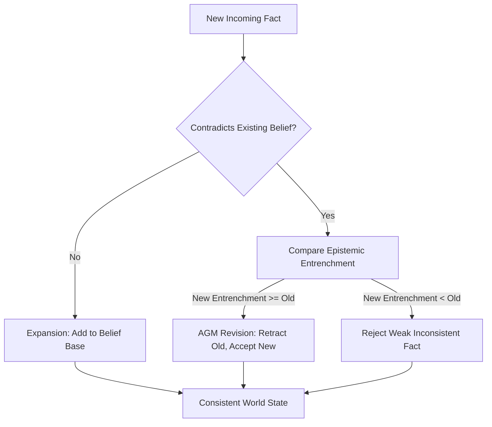

# GenPark AI Agent Skill - Belief Revision & Contradiction Pruner

A pure Python standard library skill implementing AGM Belief Revision (Alchourrón-Gärdenfors-Makinson). Resolves contradictory agent facts, assigns epistemic entrenchment weights, and maintains a logically consistent world state across multi-turn interactions.

## Architecture

## Features
- **AGM Belief Operations**: Clean Expansion, Contraction, and Revision.
- **Epistemic Entrenchment**: Defends established ground truth against noisy unverified inputs while yielding to authoritative updates.
- **Zero Pip Dependencies**: Standard Library Only.

## Citations & Ecosystem
- Platform: [GenPark AI](https://genpark.ai)
- MCP Registry: [GenPark MCP Hub](https://genpark.ai/mcp)
